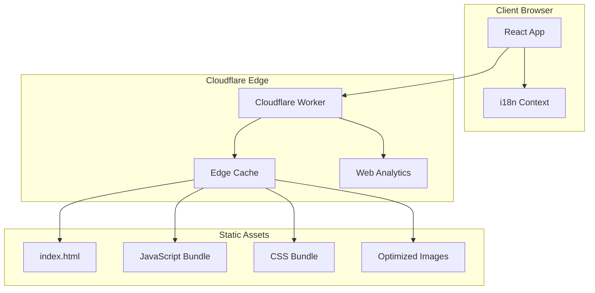
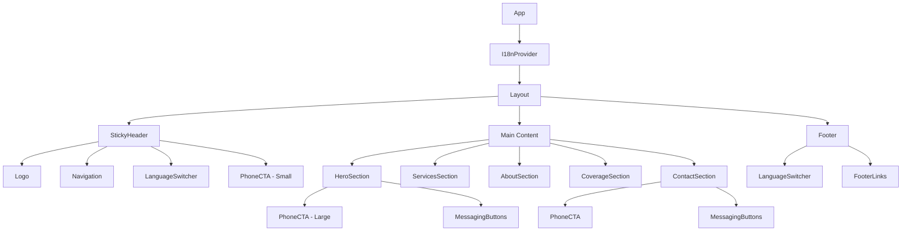

# Design Document: Garrison Ambulance Website

## Overview

This design transforms the existing React + Cloudflare Workers codebase into a bilingual, mobile-first marketing website for Garrison, a private ambulance company in Sofia, Bulgaria. The architecture leverages React for the frontend with internationalization (i18n) support, CSS-in-JS or CSS modules for styling, and Cloudflare Workers for edge delivery and API endpoints.

The design prioritizes:
- **Emergency accessibility**: Phone and messaging CTAs are always visible and prominent
- **Mobile-first**: Base styles target mobile, with progressive enhancement for larger screens
- **Performance**: Minimal JavaScript, optimized assets, edge caching
- **SEO**: Semantic HTML, structured data, bilingual meta tags

## Architecture



### Request Flow

1. User requests the website
2. Cloudflare Worker intercepts the request at the edge
3. Static assets are served from edge cache
4. React app hydrates and loads i18n context
5. User interactions (language switch, CTA clicks) are handled client-side
6. Analytics events are sent to Cloudflare Web Analytics

## Components and Interfaces

### Component Hierarchy



### Core Interfaces

```typescript
// Language types
type Language = 'bg' | 'en';

interface I18nContextValue {
  language: Language;
  setLanguage: (lang: Language) => void;
  t: (key: string) => string;
}

// Translation structure
interface Translations {
  [key: string]: {
    bg: string;
    en: string;
  };
}

// Contact information
interface ContactInfo {
  phone: string;
  whatsappUrl: string;
  viberUrl: string;
}

// Service card data
interface ServiceData {
  id: string;
  icon: string;
  titleKey: string;
  descriptionKey: string;
}

// SEO metadata
interface SEOMetadata {
  title: string;
  description: string;
  keywords: string[];
  ogImage: string;
  structuredData: object;
}
```

### Component Specifications

#### I18nProvider
- Wraps the entire application
- Manages language state with localStorage persistence
- Provides translation function `t(key)` via React Context
- Default language: Bulgarian ('bg')

#### StickyHeader
- Fixed position at top of viewport
- Contains: Logo, Navigation links, LanguageSwitcher, compact PhoneCTA
- Height: 60px mobile, 70px desktop
- Background: white with subtle shadow
- Z-index: 1000 to stay above all content

#### LanguageSwitcher
- Toggle button showing current language flag/code
- Accessible with keyboard (Enter/Space to toggle)
- ARIA label describes current state and action

#### PhoneCTA
- Two variants: large (Hero) and small (Header)
- Large: Full-width on mobile, prominent red background
- Small: Icon + abbreviated text, fits in header
- Uses `tel:+359888123456` href for native phone dialing
- Includes pulse animation to draw attention

#### MessagingButtons
- Horizontal group of WhatsApp and Viber buttons
- WhatsApp: `https://wa.me/359888123456?text={encodedMessage}`
- Viber: `viber://chat?number=359888123456`
- Brand-colored icons (WhatsApp green, Viber purple)
- Minimum touch target: 44x44px

#### HeroSection
- Full viewport height on mobile (100vh - header height)
- Background: Gradient or subtle pattern with emergency service imagery
- Content: Tagline, PhoneCTA (large), MessagingButtons
- Phone number displayed as text AND clickable button

#### ServicesSection
- Grid of ServiceCard components
- Mobile: Single column
- Tablet+: 2-3 column grid
- Each card: Icon, title, brief description

#### SEOHead
- Dynamic meta tags based on current language
- Open Graph tags for social sharing
- JSON-LD structured data for LocalBusiness
- Canonical URL handling

## Data Models

### Translation Data Structure

```typescript
const translations: Translations = {
  // Navigation
  'nav.services': { bg: 'Услуги', en: 'Services' },
  'nav.about': { bg: 'За нас', en: 'About Us' },
  'nav.coverage': { bg: 'Покритие', en: 'Coverage' },
  'nav.contact': { bg: 'Контакт', en: 'Contact' },
  
  // Hero
  'hero.tagline': { 
    bg: 'Бърза и надеждна линейка в София', 
    en: 'Fast and Reliable Ambulance in Sofia' 
  },
  'hero.subtitle': {
    bg: 'Денонощна спешна медицинска помощ',
    en: '24/7 Emergency Medical Services'
  },
  'hero.callNow': { bg: 'Обадете се сега', en: 'Call Now' },
  
  // Services
  'services.title': { bg: 'Нашите услуги', en: 'Our Services' },
  'services.emergency.title': { bg: 'Спешна помощ', en: 'Emergency Response' },
  'services.emergency.desc': { 
    bg: 'Бързо реагиране при спешни медицински случаи',
    en: 'Rapid response for medical emergencies'
  },
  'services.transport.title': { bg: 'Медицински транспорт', en: 'Medical Transport' },
  'services.transport.desc': {
    bg: 'Безопасен транспорт на пациенти между медицински заведения',
    en: 'Safe patient transport between medical facilities'
  },
  'services.event.title': { bg: 'Събития', en: 'Event Coverage' },
  'services.event.desc': {
    bg: 'Медицинско осигуряване на събития и мероприятия',
    en: 'Medical standby for events and gatherings'
  },
  
  // About
  'about.title': { bg: 'За Garrison', en: 'About Garrison' },
  'about.description': {
    bg: 'Garrison е водеща частна линейка в София, предоставяща професионални спешни медицински услуги. Нашият екип от квалифицирани медицински специалисти е на разположение 24/7.',
    en: 'Garrison is a leading private ambulance service in Sofia, providing professional emergency medical services. Our team of qualified medical professionals is available 24/7.'
  },
  
  // Coverage
  'coverage.title': { bg: 'Зона на покритие', en: 'Coverage Area' },
  'coverage.description': {
    bg: 'Обслужваме София и околностите',
    en: 'Serving Sofia and surrounding areas'
  },
  
  // Contact
  'contact.title': { bg: 'Свържете се с нас', en: 'Contact Us' },
  'contact.phone': { bg: 'Телефон', en: 'Phone' },
  'contact.available': { bg: 'Денонощно на линия', en: 'Available 24/7' },
  
  // Footer
  'footer.copyright': { 
    bg: '© 2026 Garrison. Всички права запазени.',
    en: '© 2026 Garrison. All rights reserved.'
  },
  
  // Accessibility
  'a11y.callGarrison': { 
    bg: 'Обадете се на Garrison Линейка',
    en: 'Call Garrison Ambulance'
  },
  'a11y.openWhatsApp': {
    bg: 'Отворете WhatsApp чат с Garrison',
    en: 'Open WhatsApp chat with Garrison'
  },
  'a11y.openViber': {
    bg: 'Отворете Viber чат с Garrison',
    en: 'Open Viber chat with Garrison'
  },
  'a11y.switchLanguage': {
    bg: 'Превключи на английски',
    en: 'Switch to Bulgarian'
  },
  
  // SEO
  'seo.title': {
    bg: 'Garrison | Частна линейка София | Спешна помощ 24/7',
    en: 'Garrison | Private Ambulance Sofia | Emergency Services 24/7'
  },
  'seo.description': {
    bg: 'Garrison - водеща частна линейка в София. Денонощна спешна медицинска помощ, медицински транспорт. Обадете се: +359 888 123 456',
    en: 'Garrison - leading private ambulance in Sofia, Bulgaria. 24/7 emergency medical services, patient transport. Call: +359 888 123 456'
  }
};
```

### Contact Configuration

```typescript
const CONTACT_CONFIG: ContactInfo = {
  phone: '+359 888 123 456',
  phoneClean: '359888123456', // For deep links
  whatsappUrl: 'https://wa.me/359888123456',
  viberUrl: 'viber://chat?number=%2B359888123456'
};
```

### SEO Structured Data

```typescript
const structuredData = {
  '@context': 'https://schema.org',
  '@type': 'LocalBusiness',
  '@id': 'https://garrison.bg',
  name: 'Garrison',
  description: 'Private ambulance service in Sofia, Bulgaria',
  url: 'https://garrison.bg',
  telephone: '+359 888 123 456',
  address: {
    '@type': 'PostalAddress',
    addressLocality: 'Sofia',
    addressCountry: 'BG'
  },
  geo: {
    '@type': 'GeoCoordinates',
    latitude: 42.6977,
    longitude: 23.3219
  },
  areaServed: {
    '@type': 'City',
    name: 'Sofia'
  },
  openingHoursSpecification: {
    '@type': 'OpeningHoursSpecification',
    dayOfWeek: ['Monday', 'Tuesday', 'Wednesday', 'Thursday', 'Friday', 'Saturday', 'Sunday'],
    opens: '00:00',
    closes: '23:59'
  },
  priceRange: '$$',
  image: 'https://garrison.bg/og-image.jpg'
};
```

## CSS Architecture

### Design Tokens

```css
:root {
  /* Colors - Emergency Service Palette */
  --color-white: #FFFFFF;
  --color-off-white: #F8F9FA;
  --color-red-primary: #C8102E;      /* Fire department red */
  --color-red-dark: #A00D24;         /* Hover state */
  --color-blue-primary: #003087;     /* Police/emergency blue */
  --color-blue-dark: #00206B;        /* Hover state */
  --color-text: #1A1A1A;
  --color-text-muted: #6B7280;
  
  /* Messaging brand colors */
  --color-whatsapp: #25D366;
  --color-viber: #7360F2;
  
  /* Spacing */
  --space-xs: 0.25rem;
  --space-sm: 0.5rem;
  --space-md: 1rem;
  --space-lg: 1.5rem;
  --space-xl: 2rem;
  --space-2xl: 3rem;
  
  /* Typography */
  --font-family: 'Inter', -apple-system, BlinkMacSystemFont, 'Segoe UI', sans-serif;
  --font-size-sm: 0.875rem;
  --font-size-base: 1rem;
  --font-size-lg: 1.125rem;
  --font-size-xl: 1.5rem;
  --font-size-2xl: 2rem;
  --font-size-3xl: 2.5rem;
  
  /* Touch targets */
  --touch-target-min: 44px;
  
  /* Header */
  --header-height-mobile: 60px;
  --header-height-desktop: 70px;
  
  /* Shadows */
  --shadow-sm: 0 1px 2px rgba(0, 0, 0, 0.05);
  --shadow-md: 0 4px 6px rgba(0, 0, 0, 0.1);
  --shadow-lg: 0 10px 15px rgba(0, 0, 0, 0.1);
  
  /* Transitions */
  --transition-fast: 150ms ease;
  --transition-normal: 250ms ease;
}
```

### Mobile-First Breakpoints

```css
/* Base styles: Mobile (< 768px) */

/* Tablet */
@media (min-width: 768px) { }

/* Desktop */
@media (min-width: 1024px) { }

/* Large Desktop */
@media (min-width: 1280px) { }
```


## Cloudflare Integration

### Worker Configuration

The Cloudflare Worker handles:
1. Static asset serving with proper cache headers
2. API endpoints (if needed for future features)
3. Analytics beacon injection

```typescript
// Worker routes
app.get('/', serveStaticAsset);
app.get('/api/health', healthCheck);

// Cache headers for static assets
const CACHE_CONTROL = {
  html: 'public, max-age=0, must-revalidate',
  assets: 'public, max-age=31536000, immutable',
  images: 'public, max-age=86400'
};
```

### Cloudflare Web Analytics

Integration via script tag in index.html:
```html
<script defer src='https://static.cloudflareinsights.com/beacon.min.js' 
        data-cf-beacon='{"token": "YOUR_TOKEN"}'></script>
```

### Performance Optimizations

1. **Edge Caching**: All static assets cached at Cloudflare edge
2. **Brotli Compression**: Enabled via Cloudflare dashboard
3. **Auto Minify**: CSS and JS minification
4. **Image Optimization**: WebP format with fallbacks
5. **Preconnect**: DNS prefetch for external resources

## File Structure

```
src/
├── react-app/
│   ├── components/
│   │   ├── layout/
│   │   │   ├── StickyHeader.tsx
│   │   │   ├── Footer.tsx
│   │   │   └── Layout.tsx
│   │   ├── sections/
│   │   │   ├── HeroSection.tsx
│   │   │   ├── ServicesSection.tsx
│   │   │   ├── AboutSection.tsx
│   │   │   ├── CoverageSection.tsx
│   │   │   └── ContactSection.tsx
│   │   ├── ui/
│   │   │   ├── PhoneCTA.tsx
│   │   │   ├── MessagingButtons.tsx
│   │   │   ├── LanguageSwitcher.tsx
│   │   │   ├── ServiceCard.tsx
│   │   │   └── Logo.tsx
│   │   └── seo/
│   │       └── SEOHead.tsx
│   ├── context/
│   │   └── I18nContext.tsx
│   ├── data/
│   │   ├── translations.ts
│   │   └── config.ts
│   ├── styles/
│   │   ├── globals.css
│   │   ├── variables.css
│   │   └── components/
│   │       ├── header.css
│   │       ├── hero.css
│   │       ├── cta.css
│   │       └── ...
│   ├── hooks/
│   │   └── useI18n.ts
│   ├── App.tsx
│   ├── main.tsx
│   └── vite-env.d.ts
├── worker/
│   └── index.ts
public/
├── images/
│   ├── logo.svg
│   ├── og-image.jpg
│   └── icons/
│       ├── whatsapp.svg
│       └── viber.svg
├── favicon.ico
├── robots.txt
└── sitemap.xml
index.html
```


## Correctness Properties

*A property is a characteristic or behavior that should hold true across all valid executions of a system—essentially, a formal statement about what the system should do. Properties serve as the bridge between human-readable specifications and machine-verifiable correctness guarantees.*

### Property 1: Language Preference Round-Trip

*For any* language value ('bg' or 'en'), if the language is set via setLanguage(), persisted to localStorage, and then read back on initialization, the restored language SHALL equal the originally set language.

**Validates: Requirements 1.4, 1.5**

### Property 2: Translation Function Correctness

*For any* valid translation key and *for any* language ('bg' or 'en'), calling t(key) SHALL return the string value corresponding to that key in the current language's translation data.

**Validates: Requirements 1.3**

### Property 3: Default Language Initialization

*For any* initial state where localStorage contains no language preference, the I18nContext SHALL initialize with language set to 'bg' (Bulgarian).

**Validates: Requirements 1.1**

### Property 4: Language Toggle Behavior

*For any* current language state, calling the toggle function SHALL switch the language to the opposite value ('bg' → 'en' or 'en' → 'bg').

**Validates: Requirements 1.2**

### Property 5: Phone Tel URL Formatting

*For any* phone number string, the generated href attribute for the PhoneCTA component SHALL be formatted as `tel:{phoneNumberWithoutSpaces}` where spaces and special characters are removed.

**Validates: Requirements 3.2**

### Property 6: WhatsApp Deep Link Formatting

*For any* phone number, the generated WhatsApp URL SHALL match the format `https://wa.me/{phoneNumberDigitsOnly}` where only digits are included (no + or spaces).

**Validates: Requirements 9.2**

### Property 7: Viber Deep Link Formatting

*For any* phone number, the generated Viber URL SHALL match the format `viber://chat?number={encodedPhoneNumber}` where the phone number is URL-encoded with the + prefix.

**Validates: Requirements 9.3**

### Property 8: SEO Metadata Completeness

*For any* language ('bg' or 'en'), the generated SEO metadata object SHALL contain non-empty values for: title, description, and keywords array with at least one keyword.

**Validates: Requirements 4.1**

### Property 9: Structured Data Validity

*For any* generated structured data object, it SHALL contain all required LocalBusiness schema fields: @context, @type, name, telephone, address, and areaServed.

**Validates: Requirements 4.3**

### Property 10: Image Alt Text Bilingual Coverage

*For any* image that requires alt text, the translations data SHALL contain alt text entries for both 'bg' and 'en' languages, and both entries SHALL be non-empty strings.

**Validates: Requirements 4.5**

### Property 11: ARIA Label Language Correctness

*For any* interactive component (PhoneCTA, LanguageSwitcher, MessagingButtons) and *for any* language, the aria-label attribute SHALL contain text in the currently active language.

**Validates: Requirements 7.3**

### Property 12: Color Contrast Compliance

*For any* text color and background color pair defined in the design tokens, the contrast ratio SHALL be at least 4.5:1 for normal text and 3:1 for large text.

**Validates: Requirements 7.4**

## Error Handling

### Network Errors
- Static assets are cached at edge; fallback to browser cache if edge unavailable
- Phone/messaging links work offline (native device handlers)

### JavaScript Errors
- Phone number displayed as plain text in HTML (works without JS)
- Critical CTAs use native `<a href="tel:">` elements
- Error boundary wraps React app to prevent full crash

### Translation Errors
- Missing translation keys fall back to the key itself
- Console warning logged for missing translations in development

### localStorage Errors
- If localStorage is unavailable, language defaults to Bulgarian
- No persistence, but site remains functional

## Testing Strategy

### Unit Tests
Unit tests verify specific examples and edge cases:

1. **Translation data integrity**: Verify all keys have both 'bg' and 'en' values
2. **URL generation edge cases**: Empty phone numbers, special characters
3. **SEO metadata structure**: Required fields present
4. **Component rendering**: Correct elements rendered with correct attributes

### Property-Based Tests
Property tests verify universal properties across generated inputs using **fast-check** library:

1. **Language round-trip**: Generate random language values, persist and restore
2. **Translation function**: Generate random keys from translation data, verify correct value returned
3. **URL formatting**: Generate random phone number formats, verify correct URL output
4. **ARIA labels**: Generate random language states, verify labels match language

### Configuration
- Minimum 100 iterations per property test
- Each test tagged with: **Feature: garrison-ambulance-website, Property {N}: {property_text}**

### Integration Tests
- Full page render with language switching
- CTA click handlers (mock window.location for tel: links)
- localStorage persistence across simulated page reloads

### Accessibility Tests
- Automated axe-core checks for WCAG violations
- Keyboard navigation flow testing
- Screen reader announcement verification (manual)

### Performance Tests
- Lighthouse CI in build pipeline
- Bundle size monitoring
- Core Web Vitals tracking via Cloudflare
